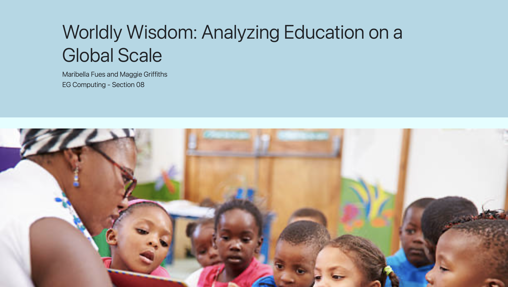

# Worldly Wisdom: Analyzing Education on a Global Scale
Link to website:
https://maribella-fues.github.io/Worldly-Wisdom-Project

Goal: By analyzing UNICEF data sets, we hoped to explore the quality of education as it varies by wealth and gender across the globe.

Visit the website to view our data visualizations and final conclusions!
